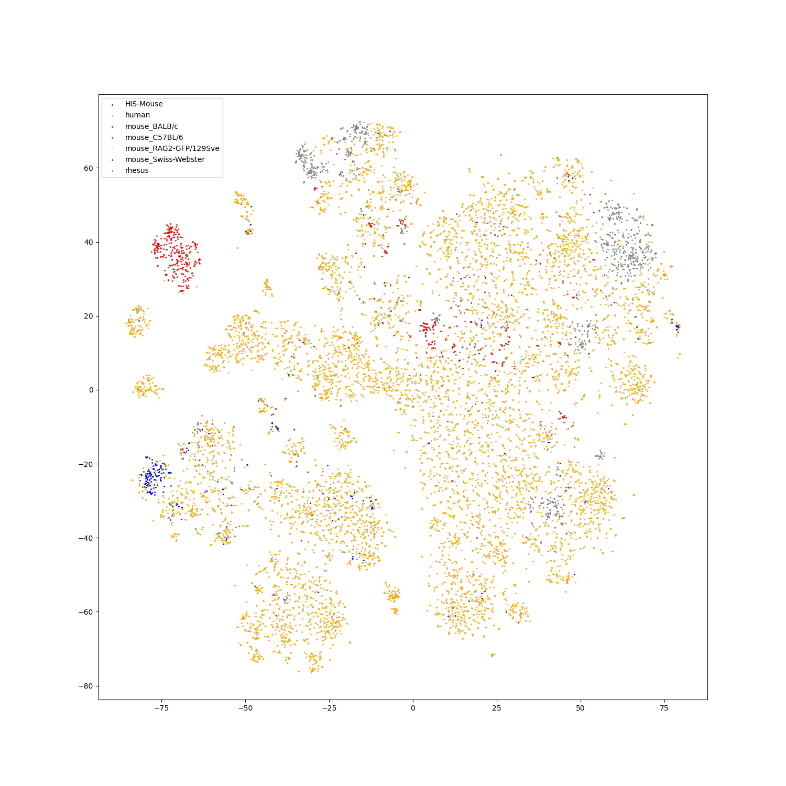

# CSSP

Contrastive Sequence-Structure Pretraining for antibody.

- [Overview](#overview)
- [Introduction](#introduction)
- [To-do List](#to-do-list)
- [Installation Guide](#installation-guide)
- [Repo contents](#repo-contents)
- [Usage](#usage)

# Overview

CSSP *(Contrastive Sequence-Structure Pretraining for antibody)* is a neural network trained on variety of (sequence, structure) pairs of antibodies. With more close relationship with antibody functions and characteristics, the structure modality of antibody would assist the feature extraction of antibody sequences, especially in the function related predictions. Moreover, with more precisely predicted antibody structures, the aligned features of sequence and structure modalities may have more interesting applications, such as antibody sequence and structure retrieval, CDR3 region residue completion given antibody structure (antibody design), antibody structure similarity calculation with only sequence information, etc.


# Introduction

Antibody data characteristics: 
1. Two main modalities: sequence and structure;
2. Different chain types and chain numbers;
3. The complexity of residue distribution varies on sequence;
4. Lack of structure data.


We use antibody data from two modalities to do model pretraining, sequence and structure, and use contrastive learning to align features from two modalities.

- Sequence modality

For sequence modality, we use BERT as model architecture. We design an input pattern especially for antibodies to unify antibodies with different chain types and chain numbers.

```
Token Embedding   : [CLS] <ASEQ> [SEP] [PAD]
Position Embedding:   0    1~n    n+1  n+1~L
Chain Embedding   :        <T>    <T>

Token Embedding   : [CLS] <ASEQ_H> [SEP] <ASEQ_L> [SEP] [PAD]
Position Embedding:   0     1~n     n+1  n+2~n+m  n+m+1 n+m+2~L
Chain Embedding   :          <H>    <H>    <L>     <L>
```

Besides, we propose *CDR focused span mask residue modeling* as pretraining task for better representation in CDR regions, especially in CDR-H3 regions.


We also use the pretraining task to finetune ESM2-3B model on antibody sequences. As ESM2 uses RoPE as positional embedding, we adjust the input pattern as follows.

```
Token Embedding   : [CLS] <ASEQ> [SEP] [PAD]
#Position Embedding:   0    1~n    n+1  n+1~L
Chain Embedding   :        <T>    <T>

Token Embedding   : [CLS] <ASEQ_H> <ASEQ_L> [SEP] [PAD]
#Position Embedding:   0     1~n    n+1~n+m  n+m+1 n+m+2~L
Chain Embedding   :          <H>     <L>     <L>
```

- Structure modality

For structure modality, we adopt Graph Transformer as model architecture. We use Igfold to predict antibody structure as training data, and use Foldseek to convert antibody structure into 3di sequence as training labels.


The features used in Graph Transformer refer to [PIFOLD](https://github.com/A4Bio/PiFold).


The input residue features are as follows

```
# single chain
token feature:   [cls]   tf1   tf2   tf3   ...   tfn
position feature:  1      2     3     4    ...    n
seq num feature:   0      0     0     0    ...    0

# paired chain
token feature:    [cls]   tf1_h   tf2_h   ...   tfm_h   tf1_l   tf2_l   ...   tfn_l
position feature:   1       2       3     ...     m      m+1     m+2    ...    m+n
seq num feature:    0       0       0     ...     0       1       1     ...     1

# tf: token feature
```

where the `seq num feature` indicates the chain number of the current input and not indicates chain types.

We treat residue features as token features and edge features as bias when calculating self-attetion scores, i.e.

$$
Attention_{i,j,l}=\frac{q_{i,l}^Tk_{j,l}}{\sqrt{d}}+bias_{i,j,l}.
$$

where $l$ is the layer index. The layer number $L$ to add bias term is set as a hyper parameter, i.e.

$$
bias_{i,j,l}=\begin{cases}bias_{i,j},l\leq L,\\ 0,l>L.\end{cases}
$$

We add an `[CLS]` token into sequence as a learnable parameter, representing the feature of the whole sequence.

When calculating edge features, we calculate the edge features of `[CLS]` token with other tokens as the sum of the outedge features of each token, as it indicates the importance of the node. (The inedge is selected with KNN nodes, so the numbers of inedges of each nodes are the same. If one node is more frequently the outedge of other nodes, this node is more important in the graph. Besides, if one node is more important in the graph, it is more affected by the update of the graph.)


We also use *CDR focused span mask 3di modeling* as pretraining task. It is noted that span mask here is necessary to avoid data leakage.

For feature alignment, we use the method of CLIP to finetune the pretrained sequence model and structure model.

- Feature visualization

We use t-SNE to do feature visualization.

For sequence modality, we extract the features of test set sequences to visualize. We use different colors to indicate different species of each antibody sequence.

Heavy chain

Light chain

Paired chain


For structure modality, we also extract the features of test set structures to visualize.

Heavy chain

Light chain

Paired chain


# To-do List

- [x] Add feature visualization scripts.
- [x] Add feature visualization result.
- [ ] Add downstream script.
- [ ] Add benchmarks running on downstream tasks.
- [ ] Release pretrained checkpoints.


# Installation Guide

Create a new environment.

```
conda create -n cssp python=3.7
conda activate cssp
```

Please install PyTorch first, and install the required pakages.

```
pip install torch==1.11.0+cu113 torchvision==0.12.0+cu113 torchaudio==0.11.0 --extra-index-url https://download.pytorch.org/whl/cu113

pip install -r requirements.txt
```

We use `mmseqs` to filter out redundant sequences. Please refer to [mmseqs](https://github.com/soedinglab/MMseqs2) for installation.

We use `igfold` to predict antibody structure. To install, please refer to [igfold](https://github.com/Graylab/IgFold), or simply use pip.

```
pip install igfold
```

The pretrained checkpoints of `igfold` would be downloaded in the igfold directory.

We use `Foldseek` to convert antibody structure into 3di sequence to do pretraining. To install, please refer to [Foldseek](https://github.com/steineggerlab/foldseek).


# Repo contents

```shell
- data/ # data process
	- sequence/ # sequence data process
		- merge_all_data_single.py # merge the downloaded dataset
		- merge_all_data_paired.py
		- get_rep_sequences_single.py # get deduplicated sequences
		- get_rep_sequences_paired.py
	- structure/ # structure data process
		- split_sequence_for_structure_predict.py
		- structure_predict/ # predict antibody structure
			- batch_predict_heavy.py
			- batch_predict_light.py
			- batch_predict_paired.py
		- structure_data_process/ # get focused positions on 3di sequences
			- process_data_direct_heavy.py
			- process_data_direct_light.py
			- process_data_direct_paired.py
			- cal_rmsd/ # calculate rmsd threshold to filter training data
				- cal_rmsd.py
	- sequence_csv2json_split_train_test.py # data process for sequence training
	- structure_csv2json_filter_split_train_test.py # data process for structure training
- sequence_pretrain/ # sequence pretraining
	- configs/ # training configs
	- dataset/
	- models/
	- optim/
	- scheduler/
	- utils/
	- visualize/ # feature visualization
	- Pretrain.py # pretrain main
	- get_embedding.py # extract antibody feature
	- utils.py
- sequence_pretrain_ft/ # sequence finetuning on ESM2-3B
- struct_pretrain/ # structure pretraining
- multi_pretrain/ # contrastive pretraining
- multi_pretrain_esm/ # contrastive pretraining with ESM2-3B
```


# Usage

## Data process

### Sequence data process

Download antibody sequence data from [OAS database](https://opig.stats.ox.ac.uk/webapps/oas/#). To download all sequences in the OAS database, please go to the unpaired and paired sequences search page and search without choosing any attributes. It is recommended to use the shell-script with the commands to download all the data-units. We download the single heavy chain, single light chain and paired chains separately into different folders.

The antibodies in the OAS database are stored in different csv files. We first merge all the csvs based on the chain types. Noted that we set 3 chain types: single heavy chain, single light chain and paired chains. Please change the saving directory accordingly.

```shell
python data/sequence/merge_all_data_single.py
python data/sequence/merge_all_data_paired.py
```

We use `mmseqs` to do sequence deduplication. We simply use `easy-linclust` mode. For more details and other usages, please refer to [mmseqs](https://github.com/soedinglab/MMseqs2). We use single heavy chain as an example.

```shell
mmseqs easy-linclust unpaired_heavy.fasta clusterRes_heavy_0.4 tmp >> tmp/output_linclust_heavy_0.4.txt 2>&1 --min-seq-id 0.4 -c 0.5
```

Run the following script to get the deduplicated sequences and their CDR regions.

```shell
python data/sequence/get_rep_sequences_single.py
python data/sequence/get_rep_sequences_paired.py
```

Finally, we convert the resulting csv files into json files for training.

```shell
python data/sequence_csv2json_split_train_test.py
```

### Structure data process

We use `Igfold` to predict antibody structures based on antibody sequences. We use `mmseqs` to deduplicate sequences again, and split sequences into different files for efficiency.

```shell
mmseqs easy-linclust unpaired_heavy.fasta clusterRes_heavy_0.3 tmp >> tmp/output_linclust_heavy_0.3.txt 2>&1 --min-seq-id 0.3 -c 0.5

python data/structure/split_sequence_for_structure_predict.py
```

Predict antibody structure with `Igfold`. Please change the saving directories accordingly.

```shell
python data/structure/structure_predict/batch_predict_heavy.py
python data/structure/structure_predict/batch_predict_light.py
python data/structure/structure_predict/batch_predict_paired.py
```

We use `Foldseek` to convert antibody structure into 3di sequence. For more details and usages, please refer to [Foldseek](https://github.com/steineggerlab/foldseek).

```shell
foldseek createdb heavy/split_predict/0/ DB_heavy_0
foldseek lndb DB_heavy_0_h DB_heavy_0_ss_h
foldseek convert2fasta DB_heavy_0_ss heavy/DB_heavy_0_ss.fasta
```

The converted 3di sequence is corresponding with the residue sequence, so we can use the residues in CDR regions to find the corresponding positions on 3di sequence for focused training.

```shell
python data/structure/structure_data_process/process_data_direct_heavy.py
python data/structure/structure_data_process/process_data_direct_light.py
python data/structure/structure_data_process/process_data_direct_paired.py
```

The resulting file can look as below:

|      | sequence  | cdr1     | cdr2     | cdr3              | species | file_name                      | pdb_file           |
| ---- | --------- | -------- | -------- | ----------------- | ------- | ------------------------------ | ------------------ |
| 0    | DWA...YDD | PDQQQQWK | ARQVVGDI | FIWGPDPDPDPPDDSPY | human   | SRR8365336_1_Heavy_Bulk.csv.gz | output_2_62233.pdb |
| 1    | DAK...HHD | PDQLLQWK | AGSVGDI  | FTFCCPPDDDPDDRPD  | human   | SRR8365336_1_Heavy_Bulk.csv.gz | output_2_62234.pdb |
| ...  | ...       | ...      | ...      | ...               | ...     | ...                            | ...                |

The `Igfold` gives a predicted rmsd value as prediction confidence. We use it to filter out wrongly predicted structures. Before that, we need to determine the filtering threshold.

```shell
python data/structure/structure_data_process/cal_rmsd/cal_rmsd.py
```

We give our thresholds as reference.

| heavy | light | paired |
| ----- | ----- | ------ |
| 1.9   | 1.9   | 1.5    |

The distributions of rmsds of each chain types are shown below.


Finally, we convert the resulting csv files into json files for training.

```shell
python data/structure_csv2json_filter_split_train_test.py
```

## Training

- **Sequence pretrain**

To pretrain from scratch in sequence modality, run scripts as follows:

```shell
cd sequence_pretrain/
python -m torch.distributed.launch --nproc_per_node=4 --use_env Pretrain.py --config ./configs/Pretrain.yaml --output_dir output/Pretrain_sequence
```

Evaluate the pretraining performance in MLM task.

```shell
cd sequence_pretrain/
python -m torch.distributed.launch --nproc_per_node=4 --use_env evaluate.py --config ./configs/evaluate.yaml --output_dir output/evaluate --ckpt_path <ckpt_path>
```

You can adjust the focused range in sequences using the `mlm_probability` in `evaluate.yaml`. If it is set to `0.0`, only CDR3 regions of the sequences will be masked. The higher the `mlm_probability` is, the greater the probability of other regions being masked will be.

```yaml
max_sl: 256
batch_size: 80
mlm_probability: 0.0 #0.2 #0.5
```

Extract the sequence features with pretrained checkpoints.

```shell
cd sequence_pretrain/
python get_embedding.py --config ./configs/embedding.yaml
```

- **Sequence finetuning on ESM2**

We also provide scripts to finetune pretrained ESM2-3B on antibody sequences. Please download [ESM2 checkpoints](https://dl.fbaipublicfiles.com/fair-esm/models/esm2_t36_3B_UR50D.pt) before running the scripts.

```shell
cd sequence_pretrain_ft/
python -m torch.distributed.launch --nproc_per_node=4 --use_env Pretrain.py --config ./configs/Pretrain_3B.yaml --output_dir output/Pretrain_ft
```

- **Structure pretrain**

Change the processed file paths in `Pretrain.yaml` and adjust other hyper parameters.

```yaml
train_file: [
  'data/train/heavy0.json',
  'data/train/heavy1.json',
  'data/train/heavy2.json',
  'data/train/heavy3.json',
  'data/train/heavy4.json',
  
  'data/train/light0.json',
  'data/train/light1.json',
  'data/train/light2.json',
  'data/train/light3.json',
  'data/train/light4.json',
  
  'data/train/paired0.json',
  'data/train/paired1.json',
  'data/train/paired2.json',
  'data/train/paired3.json',
  'data/train/paired4.json'
  ]

pdb_root: 'antibody_data/structure_data/'

topk: 20
num_rbf_node: 8
num_rbf_edge: 16

bert_config: 'configs/config_bert.json'

max_sl: 256
batch_size: 64
bias_layer_num: 12
mlm_probability: 0.2

optimizer: {opt: adamW, lr: 1e-4, weight_decay: 0.01}
schedular: {sched: cosine, lr: 1e-4, epochs: 25, min_lr: 1e-5, 
            decay_rate: 1, warmup_lr: 1e-5, warmup_epochs: 3, cooldown_epochs: 0}
```

Pretrain from scratch in structure modality.

```shell
cd struct_pretrain/
python -m torch.distributed.launch --nproc_per_node=4 --use_env Pretrain.py --config ./configs/Pretrain.yaml --output_dir output/Pretrain_struct
```

Evaluate the pretraining performance in MLM task.

```shell
cd struct_pretrain/
python -m torch.distributed.launch --nproc_per_node=4 --use_env evaluate.py --config ./configs/evaluate.yaml --output_dir output/evaluate --ckpt_path <ckpt_path>
```

You can also adjust the focused range in 3di sequences using the `mlm_probability` in `evaluate.yaml`.

Extract the structure features with pretrained checkpoints.

```shell
cd struct_pretrain/
python get_embedding.py --config ./configs/embedding.yaml
```

- **Contrastive pretrain**

We use contrastive learning to align the features from sequence modality and structure modality.

```shell
cd multi_pretrain/
python -m torch.distributed.launch --nproc_per_node=4 --use_env Pretrain.py --config ./configs/Pretrain.yaml --output_dir output/Pretrain_contrastive
```

Extract features with trained checkpoints.

```shell
cd multi_pretrain/
python get_embedding.py --config ./configs/embedding.yaml
```

- **Contrastive pretrain on ESM2**

We also provide the scripts to align the features from ESM2-3B and pretrained structure model using contrastive learning.

```shell
cd multi_pretrain_esm/
python -m torch.distributed.launch --nproc_per_node=4 --use_env Pretrain.py --config ./configs/Pretrain.yaml --output_dir output/Pretrain_contrastive_esm
```

Extract features with trained checkpoints.

```shell
cd multi_pretrain_esm/
python get_embedding.py --config ./configs/embedding.yaml
```

## Feature visualization

We provide scripts to do feature visualization of trained checkpoints using dimension reduction models (t-SNE, PCA, UMAP).

Take sequence pretraining model as an example. We first get json files for feature extraction.

```shell
cd sequence_pretrain/visualize
python get_visualize_json.py
```

Adjust the file paths in `embedding.yaml`, and run feature extraction script.

```shell
cd sequence_pretrain/
python get_embedding.py --config ./configs/embedding.yaml
```

Run feature dimension reduction script.

```shell
cd sequence_pretrain/visualize
python visualize.py
```


# Acknowledgement

We thank [MMseqs2](https://github.com/soedinglab/MMseqs2), [IgFold](https://github.com/Graylab/IgFold), [Foldseek](https://github.com/steineggerlab/foldseek), [PiFold](https://github.com/A4Bio/PiFold), [ESM2](https://github.com/facebookresearch/esm) for their great work.


# License

This project is covered under the **MIT License**.